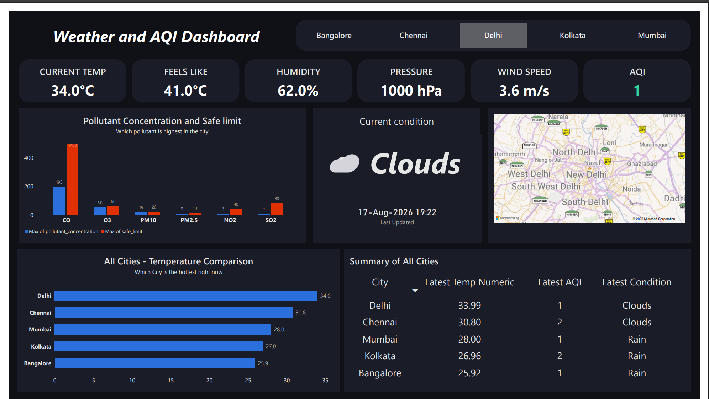
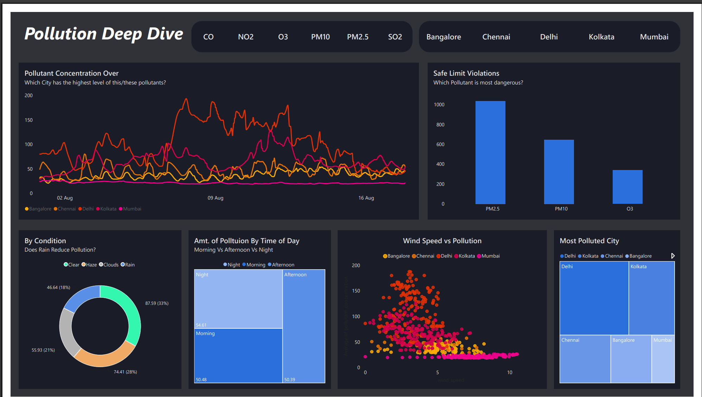

# India Weather & Air Quality Dashboard

Real-time weather and air quality monitoring dashboard tracking 5 Indian metros. An automated pipeline collects data every 15 minutes, stores it in a cloud database, and feeds a live Power BI dashboard.

## Dashboard Preview

### Page 1 - Live Overview


Select a city to see its current temperature, feels like, humidity, pressure, wind speed, AQI level, pollutant concentrations against safe limits, weather condition, and map location. The bottom section compares all cities independent of the selected filter.

### Page 2 - Pollution Deep Dive


Filter by pollutant and city to explore concentration trends over time, safe limit violations, pollution by weather condition, time of day analysis, wind speed correlation, and city pollution rankings.

## Architecture

```
OpenWeatherMap APIs
    ├── Weather API (v2.5)
    └── Air Pollution API (v2.5)
            │
            ▼
    Python Ingestion Script
    (automated via GitHub Actions)
            │
            ▼
    PostgreSQL on Neon (Cloud)
    Star Schema: 4 dimension + 1 fact table
            │
            ▼
    Power BI Dashboard (DirectQuery)
    2 pages: Live Overview + Pollution Deep Dive
```

## Data Model - Star Schema

| Table | Type | Purpose |
|-------|------|---------|
| `locations` | Dimension | 5 Indian metros with lat/lon coordinates |
| `time` | Dimension | Auto-populated timestamps per ingestion run |
| `pollutants` | Dimension | PM2.5, PM10, NO2, SO2, CO, O3 with safe limits |
| `weather_conditions` | Dimension | Clear, Haze, Rain, Clouds etc. with severity levels |
| `fact_weather_readings` | Fact | Temperature, humidity, wind, pressure, AQI, pollutant concentrations |
| `latest_readings` | View | Pre-computed latest reading per city per pollutant for fast Page 1 queries |

Each run produces 30 rows (5 cities x 6 pollutants). Approximately 2,880 rows per day.

## Key Findings (from 18 days of data)

- **PM2.5 is the most dangerous pollutant** across Indian metros, with over 1000 safe limit violations during the collection period
- **Delhi leads in pollution** consistently, especially in PM2.5 and PM10 concentrations
- **Rain reduces pollution significantly**: average concentration during rain is 46.64 compared to 87.59 during clear weather
- **Night pollution is slightly higher** (54.61) than morning (50.48) and afternoon (50.39)
- **Higher wind speed correlates with lower pollution**, visible as a downward trend in the scatter plot
- **Mumbai and Bangalore are the cleanest cities** in the dataset with the lowest average concentrations

## Tech Stack

| Component | Technology |
|-----------|-----------|
| Data Ingestion | Python, requests |
| Database | PostgreSQL on Neon (cloud) |
| DB Connector | psycopg2 |
| Automation | GitHub Actions (scheduled workflow) |
| Visualization | Power BI Desktop (DAX, DirectQuery) |
| Data Source | OpenWeatherMap Weather + Air Pollution APIs |
| Version Control | Git, GitHub |

## Project Structure

```
Weather_DASH/
├── Dashboard/
│   ├── config.py              # DB config and API endpoints
│   ├── db.py                  # Database connection and table creation
│   ├── seed.py                # Seed dimension tables with initial data
│   ├── fetch_rawactuals.py    # Main ingestion script
│   └── db_helpers.py          # FK lookup helper functions
├── screenshots/
│   ├── page1.png
│   └── page2.png
├── Weather_Dashboard.pdf      # Dashboard export
├── Weather_Dashboard.pbix     # Power BI file
├── requirements.txt
├── .github/
│   └── workflows/
│       └── fetch_data.yml     # GitHub Actions automation
└── README.md
```

## Setup Instructions

1. Clone the repository
2. Create a free PostgreSQL database on [Neon](https://neon.tech)
3. Sign up for a free API key at [OpenWeatherMap](https://openweathermap.org)
4. Create a `.env` file in the project root:
   ```
   WEATHER_API_KEY=your_openweathermap_key
   DB_HOST=your_neon_host
   DB_NAME=neondb
   DB_USER=neondb_owner
   DB_PASSWORD=your_password
   ```
5. Install dependencies:
   ```
   pip install -r requirements.txt
   ```
6. Create tables and seed dimension data:
   ```
   python Dashboard/db.py
   python Dashboard/seed.py
   ```
7. Run the ingestion script manually to verify:
   ```
   python Dashboard/fetch_rawactuals.py
   ```
8. Connect Power BI Desktop to your Neon database using the PostgreSQL connector

## Automation

GitHub Actions runs the ingestion script on a scheduled interval. Secrets (API key, database credentials) are stored in the repository settings under Actions secrets. The workflow installs dependencies, sets environment variables, and executes the ingestion script.

## Future Improvements

- Calculate Indian AQI (0-500 scale) from raw pollutant concentrations
- Add more cities or international locations
- Deploy ingestion on AWS Lambda with CloudWatch triggers
- Add ESP32 hardware sensor for ground-truth comparison
- Build a third page for predictive forecasting using ML models
- Implement alerting when pollutants cross safe limits
